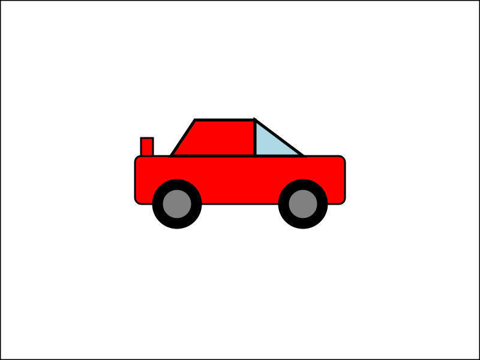
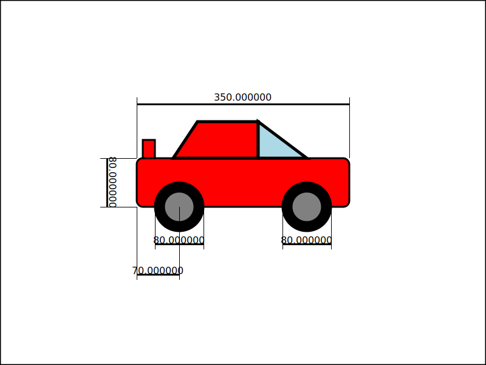
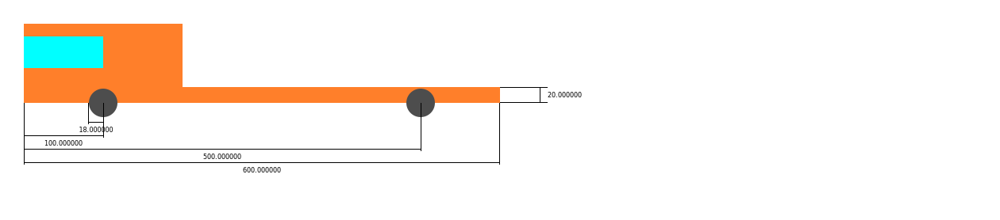
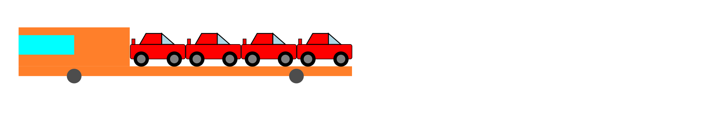

# HOMEWORK 1 (DII - Tecniche di programmazione avanzata)

Il seguente progetto prevede la creazione di un device cons estensione .svg. Il device consiste in una macchina che può essere personalizzata dall'utente. Successivamente il progetto viene implementato con un altro device sviluppato da un altro collega. 

# SVG DEVICE

## device car

Di seguito viene riportato un esempio di macchina sviluppata utilizzando opportuni parametri.

Il file .svg può essere ulteriormente implementato inserendo la quotatura.

## Parametri di progetto

Il programma permette di disegnare una macchina inserendo determinati parametri.

Parametri da inserire:

- Dimensioni del disegno
    - Dimensione 'x'
    - Dimensione 'y'

- Dimensioni carrozzeria della macchina
    - Lunghezza
    - Altezza

- Posizione della macchina nel foglio
    - Coordinata 'x'
    - Coordinata 'y'

- Dimensioni ruote
    - '16' pollici
    - '17' pollici
    - '18' pollici

- Assetto della macchina
    - Assetto pista
    - Assetto strada
    - Assetto fuoristrada

## Vincoli dimensionali

I parametri devo rispettare determinati vincoli che cercano di rendere il più realistico possibile il veicolo.

- Il rapporto tra lunghezza e altezza della macchina non deve essere inferiore a 3

- La posizione x della macchina deve essere tale da garantire che la macchhina non vada fuori dal foglio di lavoro

- La posizione y della macchina deve essere tale da garantire che la machhina non vada fuori dal foglio di lavoro

- I cerchioni disponibili sono di tre misure: 16" 17" 18"

- Gli assetti disponibili sono di tre tipi: Pista, Strada, Fuoristrada

## Funzionamento programma

~~~
Menu macchina
[a] -> Scrivere un file svg
[b] -> Scrivere un file svg con quotatura
[c] -> Salvare un file svg 
[d] -> Caricare un file svg
[e] -> Modificare un parametro file svg
[f] -> Stampa stringa svg a terminale
[q] -> Uscire dal menu macchina
~~~

### [a] Scrivere un file .svg

Questa opzione permette di scrivere il file svg inserendo i parametri della macchina richiesti a terminale. Ad ogni parametro inserito verrà verificato il rispetto del vincolo, in caso di non rispetto del vincolo viene segnalato l'errore.

### [b] Scrivere un file .svg con quotatura

Questa opzione permette di scrivere un file svg come nel primo caso ma con l'aggiunta della quotatura a disegno.

### [c] Salvare un file .svg

Questa opzione permette di salvare il file svg presente nel programma, importante mettere l'estensione nel nome, esempio: nomefile.svg

### [d] Caricare un file .svg

Questa opzione permette di caricare un file svg e di inserire i parametri della macchina presente nel file svg all'interno della struct del programma.

### [e] Modificare un parametro del file .svg

Questa opzione permette di modificare un parametro della macchina, il parametro modificato viene posto a verifica dei vincoli.

### [f] Stampa stringa svg a terminale

Questa operazione stampa la stringa svg salvata nel programma a terminale.

### [q] Uscire dal programma

Questa operazione termina il programma.

## device motrice

## MISURE
Le misure richieste per la creazione dell’file “.svg” sono:
- la larghezza del pianale
- l’altezza del pianale
- la posizione x della ruota anteriore
- la posizione y della ruota posteriore
- i raggi delle ruote (che sono assunti uguali)

## LIMITI CHE LE MISURE DEVONO RISPETTARE
Le misure devono rispettare i seguenti limiti:
- le dimensioni del pianale non hanno alcun limite
- i raggi delle due ruote devono essere minori dell’altezza del pianale
- la ruota anteriore deve essere situata nella prima metà del pianale
- la ruota posteriore deve essere situata nella seconda metà del pianale

Le misure degli altri componenti invece sono derivate dal programma, in particolare:
- la cabina si è alta 4 volte il pianale e larga 1/3
- il vetro è largo la metà della cabina e anche alto la metà, mentre è posto a 1/5 della sua altezza partendo dall’alto
- vetro, cabina e pianale sono allineati sulla linea frontale
- le ruote sono incernierate su bordo inferiore del pianale

## USO DEL PROGRAMMA PER L’UTENTE
Per usare il programma si può seguire la semplice guida che viene stampata all’inizio di esso:

~~~
 Menu motrice:
 [l] - caricare svg da file
 [c] - creare un nuovo svg
 [s] - salvare svg su file
 [q] - quit
~~~

Lanciando il comando “l” viene richiesto di inserire il nome del file da cui si vuole caricare i parametri e in seguito essi vengono caricati per mezzo della funzione menini_parse().

Lanciando il comando “c” vengono richiesti uno alla volta i parametri, bloccando l’inserimento qualora essi non siano ammessi secondo i limiti di cui sopra.

Lanciando il comando “s” viene richiesto il nome del file su cui salvare il device e in seguito viene richiesto se si vuole salvare o meno anche le misure insieme ad esso.

Lanciando il comando “q” si esce invece dal programma

# SVG MACHINE

Macchina + Motrice

