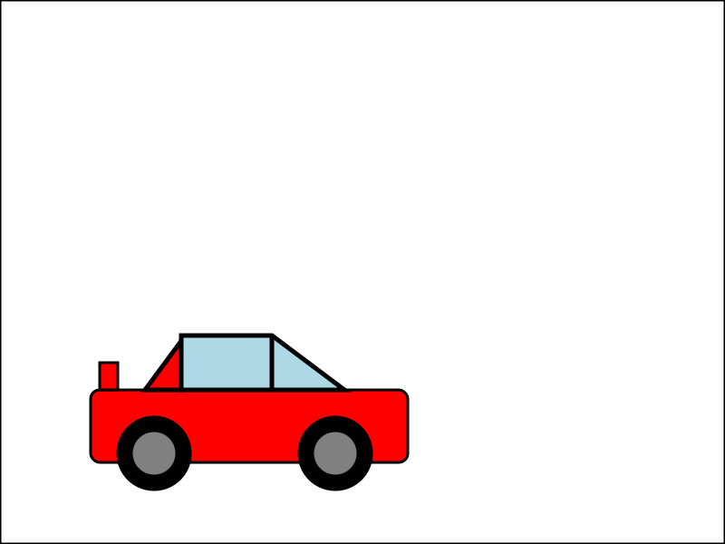
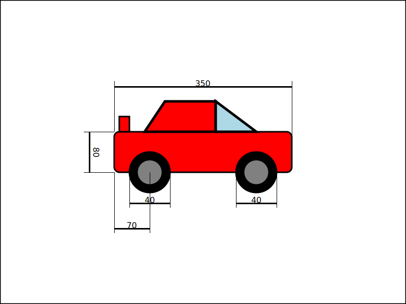

# DII - Tecniche di programmazione avanzata

Homework 1

## SVG device

Macchina

Parametri da inserire:
_ Altezza macchina
_ Lunghezza macchina
_ Dimensioni ruote
_ Posizione x delle ruote

Macchina quotata

## SVG MACHINE

Macchina + .....