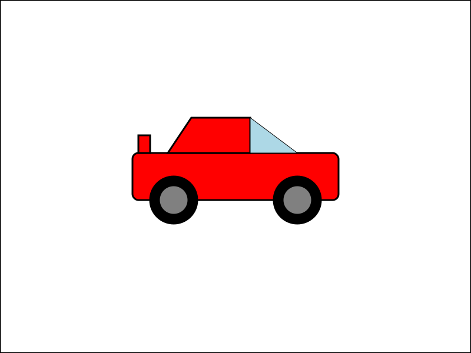

# DII - Tecniche di programmazione avanzata

Homework 1

## SVG device

Macchina

Macchina quotata

## FUNZIONAMENTO PROGRAMMA

Il programma permette di disegnare una macchina inserendo determinati parametri.

Parametri da inserire:
- Altezza macchina
- Lunghezza macchina
- Dimensioni ruote
- Assetto della macchina

I parametri devo rispettare determinati vincoli che rendono il più realistico possibile il veicolo

- Il rapporto tra lunghezza e altezza della macchina non deve essere inferiore a 3
- La posizione x della macchina deve essere tale da garantire che la macchhina non vada fuori dal foglio di lavoro
- La posizione y della macchina deve essere tale da garantire che la machhina non vada fuori dal foglio di lavoro
- I cerchioni disponibili sono di tre misure: 16" 17" 18"
- Gli assetti disponibili sono di tre tipi: Pista, Strada, Fuoristrada

Il programma inizia mostrando un menù che permette di eseguire diverse operzaioni:

~~~

[1] -> Scrivere un file svg
[2] -> Scrivere un file svg con quotatura
[3] -> Salvare un file svg 
[4] -> Caricare un file svg
[5] -> Modificare un parametro file svg
[6] -> Stampa stringa svg a terminale
[7] -> Uscire dal programma

~~~

### [1] Scrivere un file svg

Questa opzione permette di scrivere il file svg inserendo i parametri della macchina chiesti a terminale. Ad ogni parametro inserito verrà verificato il rispetto del vincolo, in caso di non rispetto del vincolo viene segnalato l'errore.

### [2] Scrivere un file svg con quotatura

Questa opzione permette di scrivere un file svg come nel primo caso ma con l'aggiunta della quotatura a disegno.

### [3] Salvare un file svg

Questa opzione permette di salvare il file svg presente nel programma, importante mettere l'estensione nel nome, esempio: nomefile.svg

### [4] Caricare un file svg

Questa opzione permette di caricare un file svg e di inserire i parametri della macchina presente nel file svg all'interno della struct del programma.

### [5] Modificare un parametro file svg

Questa opzione permette di modificare un parametro della macchina, il parametro modificato viene posto a verifica dei vincoli.

### [6] Stampa stringa svg a terminale

Questa operazione stampa la stringa svg salvata nel programma a terminale.

### [7] Uscire dal programma

Questa operazione termina il programma.

## SVG MACHINE

Macchina + Motrice

